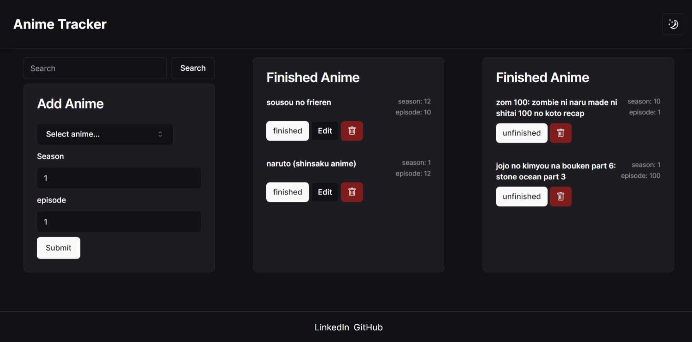
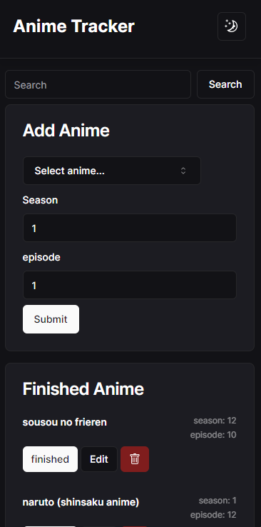

# Anime Tracker

<div align="center">
  <!-- Anime Tracker Desktop View -->
  
  <p>A snapshot of Anime Tracker's desktop view, showcasing the user interface for managing and tracking anime progress.</p>

<!-- Anime Tracker Mobile View -->
  
  <p>A glimpse of Anime Tracker's mobile view, providing a responsive design for users on smaller devices.</p>
</div>

[Anime Tracker](https://tracking-anime.netlify.app/) is a simple web application built with [Next.js](https://nextjs.org/), [Tailwind CSS](https://tailwindcss.com/), and [Shadcn UI](https://shadcn-ui.vercel.app/) to help you keep track of your anime watching progress. Whether you're an avid anime fan or just getting started, this tool allows you to record the latest episode and season you've watched for each anime, categorize them as finished or unfinished, and switch between light and dark mode for a personalized viewing experience.

## Features

- **Track Anime Progress:** Easily record the current episode and season for each anime you are watching.
- **Categorize Status:** Classify anime as finished or unfinished based on your viewing status.

- **Local Storage:** Your data is stored locally using browser's local storage, ensuring your progress is saved across sessions.

- **Dark Mode:** Switch between light and dark mode for a comfortable viewing experience, especially during late-night anime sessions.

## Getting Started

1. **Clone the Repository:**

   ```bash
   git clone https://github.com/mochavin/anime-tracker.git
   cd anime-tracker
   ```

2. **Install Dependencies:**

   ```bash
   npm install
   ```

3. **Run the Application:**

   ```bash
   npm run dev
   ```

   Open your browser and visit [http://localhost:3000](http://localhost:3000).

## Usage

1. **Add Anime:**

   - Enter the anime title, current episode, and season.
   - Click submit

2. **Edit Anime:**

   - Click on the anime title to edit its details.
   - Modify the episode, season, or status as needed.

3. **Delete Anime:**

   - Click on the icon trash to remove an anime from your tracker.

4. **Switch Dark/Light Mode:**

   - Toggle between dark and light mode using the theme switcher.

5. **LocalStorage:**

   - Your anime tracker data is automatically saved to local storage, so you won't lose your progress.

## Contributing

If you'd like to contribute to Anime Tracker, please follow these steps:

1. Fork the repository.
2. Create a new branch for your feature or bug fix.
3. Make your changes and submit a pull request.
